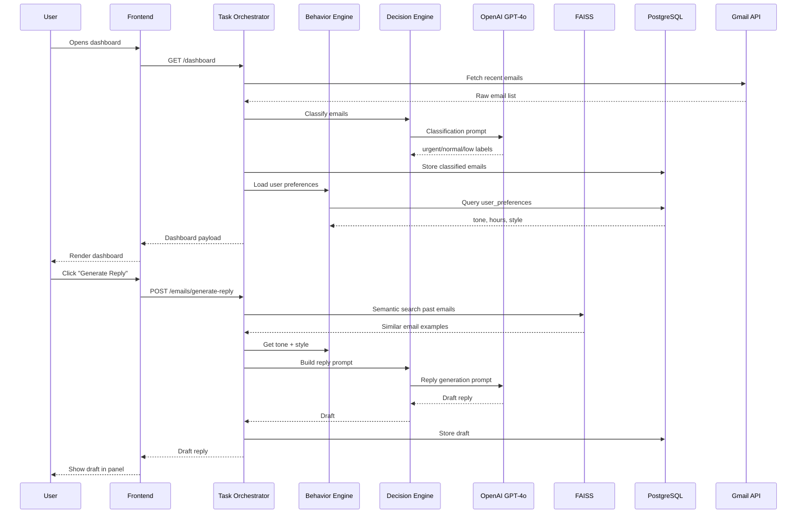
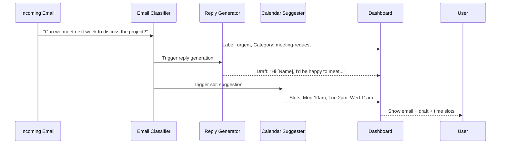

# Design Document: Clone Yourself Platform


## Overview

The Clone Yourself Platform is an AI-powered personal digital worker that learns a user's communication style and behavioral patterns to automate repetitive workflows. The system integrates with Gmail and Google Calendar to handle email classification, reply drafting, meeting scheduling, and follow-up tracking — all while mimicking the user's tone and preferences.

The platform is built on a Next.js frontend backed by a FastAPI Python service. It uses OpenAI GPT-4o for language tasks, PostgreSQL for structured data, and FAISS for semantic vector search over past emails. Three automation modes (Suggest, Approval, Auto) give users control over how aggressively the AI acts on their behalf.

The MVP focuses on three core demo flows: email reply generation in the user's tone, meeting time suggestion from calendar free slots, and a unified dashboard that surfaces priority actions and productivity metrics.


---

## Architecture

### High-Level System Architecture

```mermaid
graph TD
    subgraph Frontend["Frontend (Next.js + Tailwind — Vercel)"]
        UI[Dashboard UI]
        EmailUI[Email Assistant Panel]
        CalUI[Calendar Clone Panel]
        AnalyticsUI[Analytics Panel]
    end

    subgraph Backend["Backend (FastAPI — Render)"]
        Auth[Auth Service\nGoogle OAuth]
        TaskOrch[Task Orchestrator]
        BehaviorEngine[Behavior Engine\nUser Preferences + Style]
        DecisionEngine[Decision Engine\nLLM Prompt Router]
        EmailSvc[Email Service]
        CalSvc[Calendar Service]
        FollowupSvc[Follow-up Agent]
        FileBrain[File Brain]
        BriefSvc[Daily Brief Service]
        AnalyticsSvc[Analytics Service]
    end

    subgraph AILayer["AI Layer"]
        GPT4[OpenAI GPT-4o]
        FAISS[FAISS Vector Store\nEmail Embeddings]
        PromptMgr[Modular Prompt Manager]
    end

    subgraph DB["Database (PostgreSQL)"]
        Users[(users)]
        Emails[(emails)]
        Drafts[(reply_drafts)]
        Events[(calendar_events)]
        Followups[(followups)]
        Analytics[(analytics_events)]
        Prefs[(user_preferences)]
    end

    subgraph ExternalAPIs["External APIs"]
        GmailAPI[Gmail API]
        GCalAPI[Google Calendar API]
        GDriveAPI[Google Drive API\n(Mock)]
    end

    UI --> Auth
    UI --> TaskOrch
    EmailUI --> EmailSvc
    CalUI --> CalSvc
    AnalyticsUI --> AnalyticsSvc

    TaskOrch --> BehaviorEngine
    TaskOrch --> DecisionEngine
    TaskOrch --> EmailSvc
    TaskOrch --> CalSvc
    TaskOrch --> FollowupSvc
    TaskOrch --> BriefSvc

    BehaviorEngine --> DB
    DecisionEngine --> PromptMgr
    PromptMgr --> GPT4
    EmailSvc --> FAISS
    EmailSvc --> GmailAPI
    CalSvc --> GCalAPI
    FileBrain --> GDriveAPI

    EmailSvc --> DB
    CalSvc --> DB
    FollowupSvc --> DB
    AnalyticsSvc --> DB
    Auth --> DB
```

### Request Flow



### Demo Flow: "Can we meet next week?"




---

## Components and Interfaces

### Component 1: Auth Service

**Purpose**: Handles Google OAuth 2.0 login, token exchange, and secure session management.

**Interface**:
```python
class AuthService:
    async def google_oauth_redirect(self) -> RedirectResponse: ...
    async def google_oauth_callback(self, code: str) -> TokenResponse: ...
    async def refresh_token(self, refresh_token: str) -> TokenResponse: ...
    async def get_current_user(self, token: str) -> User: ...
    async def revoke_token(self, user_id: str) -> None: ...
```

**Responsibilities**:
- Redirect users to Google OAuth consent screen
- Exchange authorization code for access + refresh tokens
- Store encrypted tokens in PostgreSQL
- Validate JWT on every protected request
- Expose `get_current_user` dependency for FastAPI route guards

---

### Component 2: Task Orchestrator

**Purpose**: Central coordinator that routes incoming requests to the appropriate service, manages execution mode (Suggest/Approval/Auto), and aggregates results for the frontend.

**Interface**:
```python
class TaskOrchestrator:
    async def get_dashboard(self, user_id: str) -> DashboardPayload: ...
    async def process_email_action(self, user_id: str, email_id: str, action: ActionType) -> ActionResult: ...
    async def run_followup_check(self, user_id: str) -> list[FollowupSuggestion]: ...
    async def generate_daily_brief(self, user_id: str) -> DailyBrief: ...
    async def get_execution_mode(self, user_id: str) -> ExecutionMode: ...
```

**Responsibilities**:
- Aggregate data from Email, Calendar, Followup, and Analytics services
- Enforce execution mode: in Auto mode, actions execute without user confirmation
- Emit analytics events for every automated action
- Handle partial failures gracefully (return available data if one service fails)

---

### Component 3: Behavior Engine

**Purpose**: Stores and retrieves user behavioral preferences. Provides tone, style, and scheduling context to the Decision Engine.

**Interface**:
```python
class BehaviorEngine:
    async def get_user_preferences(self, user_id: str) -> UserPreferences: ...
    async def update_preferences(self, user_id: str, prefs: UserPreferences) -> None: ...
    async def get_writing_style_context(self, user_id: str, email_context: str) -> StyleContext: ...
    async def record_user_action(self, user_id: str, action: UserAction) -> None: ...
    async def infer_preferences_from_history(self, user_id: str) -> UserPreferences: ...
```

**Responsibilities**:
- Persist tone (formal/casual), working hours, meeting preferences per user
- Query FAISS for semantically similar past emails to build style context
- Learn from user edits to AI-generated drafts (feedback loop)
- Provide `StyleContext` objects consumed by the Decision Engine's prompt builder

---

### Component 4: Decision Engine (LLM Prompt Router)

**Purpose**: Constructs modular prompts and routes them to OpenAI GPT-4o. Parses structured responses.

**Interface**:
```python
class DecisionEngine:
    async def classify_email(self, email: EmailMessage, user_prefs: UserPreferences) -> EmailClassification: ...
    async def generate_reply(self, email: EmailMessage, style_ctx: StyleContext) -> ReplyDraft: ...
    async def suggest_meeting_slots(self, email: EmailMessage, free_slots: list[TimeSlot]) -> list[MeetingSlot]: ...
    async def generate_daily_brief(self, context: BriefContext) -> DailyBrief: ...
    async def suggest_followup(self, email: EmailMessage, days_elapsed: int) -> FollowupSuggestion: ...
```

**Responsibilities**:
- Maintain a library of modular prompt templates (one per task type)
- Inject user style context, email content, and calendar data into prompts
- Parse GPT-4o JSON responses into typed Pydantic models
- Implement retry logic with exponential backoff on OpenAI rate limits
- Log token usage per request for analytics

---

### Component 5: Email Service

**Purpose**: Fetches emails from Gmail API, stores them in PostgreSQL, and coordinates classification and reply generation.

**Interface**:
```python
class EmailService:
    async def fetch_emails(self, user_id: str, max_results: int = 20) -> list[EmailMessage]: ...
    async def get_email(self, user_id: str, email_id: str) -> EmailMessage: ...
    async def classify_emails(self, user_id: str, emails: list[EmailMessage]) -> list[ClassifiedEmail]: ...
    async def generate_reply_draft(self, user_id: str, email_id: str) -> ReplyDraft: ...
    async def send_reply(self, user_id: str, draft_id: str) -> SendResult: ...
    async def embed_and_store(self, user_id: str, email: EmailMessage) -> None: ...
```

**Responsibilities**:
- Authenticate Gmail API calls with user's stored OAuth token
- Parse raw Gmail message format into `EmailMessage` objects
- Generate OpenAI embeddings for each email and upsert into FAISS
- Store classified emails and drafts in PostgreSQL
- Support mock data fallback when Gmail API is unavailable

---

### Component 6: Calendar Service

**Purpose**: Integrates with Google Calendar to read free/busy slots and create events.

**Interface**:
```python
class CalendarService:
    async def get_free_slots(self, user_id: str, date_range: DateRange) -> list[TimeSlot]: ...
    async def suggest_meeting_times(self, user_id: str, email: EmailMessage) -> list[MeetingSlot]: ...
    async def create_event(self, user_id: str, slot: MeetingSlot, attendees: list[str]) -> CalendarEvent: ...
    async def get_upcoming_events(self, user_id: str, days: int = 7) -> list[CalendarEvent]: ...
```

**Responsibilities**:
- Query Google Calendar freebusy API for the next 7 days
- Filter slots against user's preferred working hours from BehaviorEngine
- Pass free slots + email context to DecisionEngine for AI-ranked suggestions
- Create calendar events with proper attendee invites

---

### Component 7: Follow-up Agent

**Purpose**: Monitors sent emails for missing replies and surfaces follow-up suggestions.

**Interface**:
```python
class FollowupAgent:
    async def check_pending_followups(self, user_id: str) -> list[FollowupSuggestion]: ...
    async def mark_resolved(self, user_id: str, followup_id: str) -> None: ...
    async def snooze(self, user_id: str, followup_id: str, until: datetime) -> None: ...
    async def generate_followup_draft(self, user_id: str, followup_id: str) -> ReplyDraft: ...
```

**Responsibilities**:
- Query emails sent more than X days ago (configurable, default 3) with no reply thread
- Use DecisionEngine to generate a contextual follow-up message
- Track follow-up status: pending, snoozed, resolved, sent
- Expose follow-up count on dashboard

---

### Component 8: Analytics Service

**Purpose**: Tracks automated actions and computes productivity metrics.

**Interface**:
```python
class AnalyticsService:
    async def record_event(self, user_id: str, event: AnalyticsEvent) -> None: ...
    async def get_dashboard_stats(self, user_id: str) -> AnalyticsStats: ...
    async def get_time_saved(self, user_id: str, period: str = "week") -> float: ...
    async def get_action_counts(self, user_id: str, period: str = "week") -> dict[str, int]: ...
```

**Responsibilities**:
- Record every automated action (reply sent, event created, followup triggered)
- Estimate time saved per action type (configurable constants: reply = 5 min, meeting = 10 min)
- Aggregate weekly/monthly stats for dashboard display


---

## Data Models

### PostgreSQL Schema

```sql
-- Users and authentication
CREATE TABLE users (
    id          UUID PRIMARY KEY DEFAULT gen_random_uuid(),
    email       TEXT UNIQUE NOT NULL,
    name        TEXT NOT NULL,
    picture_url TEXT,
    created_at  TIMESTAMPTZ DEFAULT NOW()
);

CREATE TABLE oauth_tokens (
    id              UUID PRIMARY KEY DEFAULT gen_random_uuid(),
    user_id         UUID REFERENCES users(id) ON DELETE CASCADE,
    access_token    TEXT NOT NULL,          -- encrypted at rest
    refresh_token   TEXT NOT NULL,          -- encrypted at rest
    token_expiry    TIMESTAMPTZ NOT NULL,
    scopes          TEXT[] NOT NULL,
    updated_at      TIMESTAMPTZ DEFAULT NOW()
);

-- User behavioral preferences
CREATE TABLE user_preferences (
    user_id             UUID PRIMARY KEY REFERENCES users(id) ON DELETE CASCADE,
    tone                TEXT NOT NULL DEFAULT 'casual',   -- 'formal' | 'casual'
    working_hours_start TIME NOT NULL DEFAULT '09:00',
    working_hours_end   TIME NOT NULL DEFAULT '18:00',
    working_days        INT[] NOT NULL DEFAULT '{1,2,3,4,5}', -- 1=Mon
    meeting_duration    INT NOT NULL DEFAULT 30,           -- minutes
    followup_threshold  INT NOT NULL DEFAULT 3,            -- days
    execution_mode      TEXT NOT NULL DEFAULT 'suggest',   -- 'suggest' | 'approval' | 'auto'
    updated_at          TIMESTAMPTZ DEFAULT NOW()
);

-- Emails
CREATE TABLE emails (
    id              UUID PRIMARY KEY DEFAULT gen_random_uuid(),
    user_id         UUID REFERENCES users(id) ON DELETE CASCADE,
    gmail_id        TEXT NOT NULL,
    thread_id       TEXT NOT NULL,
    subject         TEXT,
    sender          TEXT NOT NULL,
    recipient       TEXT NOT NULL,
    body_text       TEXT,
    received_at     TIMESTAMPTZ NOT NULL,
    classification  TEXT,                  -- 'urgent' | 'normal' | 'low'
    category        TEXT,                  -- 'meeting-request' | 'action-required' | 'info' | 'other'
    is_replied      BOOLEAN DEFAULT FALSE,
    embedding_id    TEXT,                  -- FAISS vector ID
    created_at      TIMESTAMPTZ DEFAULT NOW(),
    UNIQUE(user_id, gmail_id)
);

-- AI-generated reply drafts
CREATE TABLE reply_drafts (
    id          UUID PRIMARY KEY DEFAULT gen_random_uuid(),
    user_id     UUID REFERENCES users(id) ON DELETE CASCADE,
    email_id    UUID REFERENCES emails(id) ON DELETE CASCADE,
    draft_text  TEXT NOT NULL,
    status      TEXT NOT NULL DEFAULT 'pending',  -- 'pending' | 'approved' | 'sent' | 'discarded'
    sent_at     TIMESTAMPTZ,
    created_at  TIMESTAMPTZ DEFAULT NOW()
);

-- Calendar events
CREATE TABLE calendar_events (
    id              UUID PRIMARY KEY DEFAULT gen_random_uuid(),
    user_id         UUID REFERENCES users(id) ON DELETE CASCADE,
    gcal_event_id   TEXT,
    title           TEXT NOT NULL,
    start_time      TIMESTAMPTZ NOT NULL,
    end_time        TIMESTAMPTZ NOT NULL,
    attendees       TEXT[],
    source_email_id UUID REFERENCES emails(id),
    created_by_ai   BOOLEAN DEFAULT FALSE,
    created_at      TIMESTAMPTZ DEFAULT NOW()
);

-- Follow-up tracking
CREATE TABLE followups (
    id              UUID PRIMARY KEY DEFAULT gen_random_uuid(),
    user_id         UUID REFERENCES users(id) ON DELETE CASCADE,
    email_id        UUID REFERENCES emails(id) ON DELETE CASCADE,
    status          TEXT NOT NULL DEFAULT 'pending',  -- 'pending' | 'snoozed' | 'resolved' | 'sent'
    snooze_until    TIMESTAMPTZ,
    draft_id        UUID REFERENCES reply_drafts(id),
    detected_at     TIMESTAMPTZ DEFAULT NOW(),
    resolved_at     TIMESTAMPTZ
);

-- Analytics events
CREATE TABLE analytics_events (
    id              UUID PRIMARY KEY DEFAULT gen_random_uuid(),
    user_id         UUID REFERENCES users(id) ON DELETE CASCADE,
    event_type      TEXT NOT NULL,   -- 'reply_sent' | 'event_created' | 'followup_triggered' | 'email_classified'
    metadata        JSONB,
    time_saved_min  FLOAT DEFAULT 0,
    created_at      TIMESTAMPTZ DEFAULT NOW()
);

-- Indexes
CREATE INDEX idx_emails_user_received ON emails(user_id, received_at DESC);
CREATE INDEX idx_emails_classification ON emails(user_id, classification);
CREATE INDEX idx_followups_user_status ON followups(user_id, status);
CREATE INDEX idx_analytics_user_created ON analytics_events(user_id, created_at DESC);
```

### Pydantic Models (Backend)

```python
from pydantic import BaseModel, Field
from datetime import datetime, time
from typing import Optional, Literal
from uuid import UUID

class User(BaseModel):
    id: UUID
    email: str
    name: str
    picture_url: Optional[str]

class UserPreferences(BaseModel):
    tone: Literal["formal", "casual"] = "casual"
    working_hours_start: time = time(9, 0)
    working_hours_end: time = time(18, 0)
    working_days: list[int] = [1, 2, 3, 4, 5]
    meeting_duration: int = 30
    followup_threshold: int = 3
    execution_mode: Literal["suggest", "approval", "auto"] = "suggest"

class EmailMessage(BaseModel):
    id: UUID
    gmail_id: str
    thread_id: str
    subject: Optional[str]
    sender: str
    recipient: str
    body_text: Optional[str]
    received_at: datetime
    classification: Optional[Literal["urgent", "normal", "low"]]
    category: Optional[str]
    is_replied: bool = False

class ReplyDraft(BaseModel):
    id: UUID
    email_id: UUID
    draft_text: str
    status: Literal["pending", "approved", "sent", "discarded"] = "pending"

class TimeSlot(BaseModel):
    start: datetime
    end: datetime

class MeetingSlot(BaseModel):
    slot: TimeSlot
    confidence_score: float = Field(ge=0.0, le=1.0)
    reason: str

class DashboardPayload(BaseModel):
    priority_emails: list[EmailMessage]
    pending_replies: list[ReplyDraft]
    suggested_actions: list[str]
    followup_count: int
    analytics: "AnalyticsStats"

class AnalyticsStats(BaseModel):
    actions_automated: int
    time_saved_minutes: float
    emails_classified: int
    replies_sent: int
    events_created: int

class DailyBrief(BaseModel):
    urgent_items: list[str]    # exactly 3
    followups: list[str]       # exactly 2
    risk: str                  # exactly 1
    generated_at: datetime
```

### TypeScript Types (Frontend)

```typescript
export interface User {
  id: string
  email: string
  name: string
  pictureUrl?: string
}

export type EmailClassification = 'urgent' | 'normal' | 'low'
export type ExecutionMode = 'suggest' | 'approval' | 'auto'
export type DraftStatus = 'pending' | 'approved' | 'sent' | 'discarded'

export interface Email {
  id: string
  subject?: string
  sender: string
  bodyText?: string
  receivedAt: string
  classification?: EmailClassification
  category?: string
  isReplied: boolean
}

export interface ReplyDraft {
  id: string
  emailId: string
  draftText: string
  status: DraftStatus
}

export interface MeetingSlot {
  slot: { start: string; end: string }
  confidenceScore: number
  reason: string
}

export interface DashboardPayload {
  priorityEmails: Email[]
  pendingReplies: ReplyDraft[]
  suggestedActions: string[]
  followupCount: number
  analytics: AnalyticsStats
}

export interface AnalyticsStats {
  actionsAutomated: number
  timeSavedMinutes: number
  emailsClassified: number
  repliesSent: number
  eventsCreated: number
}

export interface DailyBrief {
  urgentItems: string[]
  followups: string[]
  risk: string
  generatedAt: string
}

export interface UserPreferences {
  tone: 'formal' | 'casual'
  workingHoursStart: string
  workingHoursEnd: string
  workingDays: number[]
  meetingDuration: number
  followupThreshold: number
  executionMode: ExecutionMode
}
```


---

## Key Functions with Formal Specifications

### Function 1: `classify_email()`

```python
async def classify_email(
    email: EmailMessage,
    user_prefs: UserPreferences
) -> EmailClassification:
```

**Preconditions:**
- `email.body_text` is non-null and non-empty
- `email.sender` is a valid email address string
- `user_prefs` is a valid `UserPreferences` object

**Postconditions:**
- Returns one of `"urgent"`, `"normal"`, or `"low"`
- Classification is deterministic for identical inputs (given same model temperature=0)
- No mutations to `email` or `user_prefs`
- Token usage is logged to analytics

**Loop Invariants:** N/A (single LLM call, no loops)

---

### Function 2: `generate_reply()`

```python
async def generate_reply(
    email: EmailMessage,
    style_ctx: StyleContext,
    similar_emails: list[EmailMessage]
) -> ReplyDraft:
```

**Preconditions:**
- `email.body_text` is non-null
- `style_ctx.tone` is one of `"formal"` or `"casual"`
- `len(similar_emails) >= 0` (empty list is valid — falls back to tone-only)
- OpenAI API key is configured in environment

**Postconditions:**
- Returns a `ReplyDraft` with non-empty `draft_text`
- `draft_text` matches the tone specified in `style_ctx`
- Draft is persisted to `reply_drafts` table with `status = "pending"`
- If `execution_mode == "auto"`, draft is immediately sent and status becomes `"sent"`

**Loop Invariants:** N/A

---

### Function 3: `get_free_slots()`

```python
async def get_free_slots(
    user_id: str,
    date_range: DateRange,
    user_prefs: UserPreferences
) -> list[TimeSlot]:
```

**Preconditions:**
- `date_range.start < date_range.end`
- `date_range` spans at most 14 days
- `user_prefs.working_hours_start < user_prefs.working_hours_end`
- User has a valid Google Calendar OAuth token

**Postconditions:**
- All returned slots fall within `user_prefs.working_hours_start` and `user_prefs.working_hours_end`
- All returned slots fall on days in `user_prefs.working_days`
- No returned slot overlaps with an existing calendar event
- Each slot duration equals `user_prefs.meeting_duration` minutes
- Result list is sorted ascending by `slot.start`

**Loop Invariants:**
- For each iteration over calendar events: all previously processed slots remain non-overlapping

---

### Function 4: `check_pending_followups()`

```python
async def check_pending_followups(
    user_id: str,
    threshold_days: int
) -> list[FollowupSuggestion]:
```

**Preconditions:**
- `threshold_days >= 1`
- `user_id` exists in the `users` table

**Postconditions:**
- Returns only emails where `sent_at < NOW() - threshold_days` AND `is_replied == False`
- Does not return emails with `followup.status IN ("snoozed", "resolved", "sent")`
- Each returned suggestion has a non-empty `draft_text`
- Result list is sorted by `sent_at` ascending (oldest first)

**Loop Invariants:**
- For each email processed: all previously evaluated emails either have a followup record or were skipped due to status

---

### Function 5: `embed_and_store()`

```python
async def embed_and_store(
    user_id: str,
    email: EmailMessage
) -> str:  # returns FAISS vector ID
```

**Preconditions:**
- `email.body_text` is non-null and non-empty
- FAISS index for `user_id` is initialized

**Postconditions:**
- Email embedding is stored in FAISS under the returned vector ID
- `emails.embedding_id` is updated in PostgreSQL with the returned ID
- Embedding dimension is exactly 1536 (OpenAI `text-embedding-3-small`)
- Operation is idempotent: re-embedding the same email updates the existing vector

**Loop Invariants:** N/A


---

## Algorithmic Pseudocode

### Main Email Processing Algorithm

```pascal
ALGORITHM process_incoming_email(user_id, gmail_message_id)
INPUT: user_id: UUID, gmail_message_id: String
OUTPUT: ProcessedEmailResult

BEGIN
  // Step 1: Fetch and parse raw email
  raw_email ← gmail_api.fetch_message(user_id, gmail_message_id)
  email ← parse_gmail_message(raw_email)

  ASSERT email.body_text IS NOT NULL

  // Step 2: Embed and store for future style matching
  embedding_id ← embed_and_store(user_id, email)
  email.embedding_id ← embedding_id

  // Step 3: Classify email
  user_prefs ← behavior_engine.get_user_preferences(user_id)
  classification ← decision_engine.classify_email(email, user_prefs)
  email.classification ← classification

  // Step 4: Persist classified email
  db.upsert_email(email)
  analytics.record_event(user_id, "email_classified", {classification})

  // Step 5: Determine action based on classification and execution mode
  IF classification = "urgent" OR classification = "normal" THEN
    similar_emails ← faiss.search(user_id, email.body_text, top_k=5)
    style_ctx ← behavior_engine.get_writing_style_context(user_id, email.body_text)
    draft ← decision_engine.generate_reply(email, style_ctx, similar_emails)

    IF user_prefs.execution_mode = "auto" THEN
      send_result ← gmail_api.send_reply(user_id, draft)
      draft.status ← "sent"
      analytics.record_event(user_id, "reply_sent", {time_saved_min: 5})
    ELSE
      draft.status ← "pending"
    END IF

    db.save_draft(draft)
  END IF

  // Step 6: Check if meeting request → trigger calendar suggestion
  IF email.category = "meeting-request" THEN
    date_range ← DateRange(NOW(), NOW() + 7 days)
    free_slots ← calendar_service.get_free_slots(user_id, date_range, user_prefs)
    meeting_slots ← decision_engine.suggest_meeting_slots(email, free_slots)
    db.save_meeting_suggestions(user_id, email.id, meeting_slots)
  END IF

  RETURN ProcessedEmailResult(email, draft, meeting_slots)
END
```

---

### Reply Generation Algorithm

```pascal
ALGORITHM generate_reply(email, style_ctx, similar_emails)
INPUT:
  email: EmailMessage
  style_ctx: StyleContext (tone, examples)
  similar_emails: List[EmailMessage]
OUTPUT: ReplyDraft

BEGIN
  // Build context from similar past emails
  examples_text ← ""
  FOR each past_email IN similar_emails DO
    ASSERT past_email.body_text IS NOT NULL
    examples_text ← examples_text + format_example(past_email)
  END FOR

  // Construct modular prompt
  system_prompt ← load_prompt_template("reply_generation")
  system_prompt ← inject(system_prompt, "tone", style_ctx.tone)
  system_prompt ← inject(system_prompt, "examples", examples_text)

  user_prompt ← "Reply to this email:\n\n" + email.body_text

  // Call LLM with retry
  attempts ← 0
  WHILE attempts < 3 DO
    ASSERT attempts < 3  // loop invariant: haven't exceeded retry limit
    TRY
      response ← openai.chat_completion(
        model = "gpt-4o",
        system = system_prompt,
        user = user_prompt,
        temperature = 0.7,
        max_tokens = 500
      )
      draft_text ← response.choices[0].message.content
      ASSERT draft_text IS NOT NULL AND len(draft_text) > 0
      RETURN ReplyDraft(email_id=email.id, draft_text=draft_text, status="pending")
    CATCH RateLimitError
      attempts ← attempts + 1
      sleep(2 ^ attempts seconds)  // exponential backoff
    CATCH APIError AS e
      RAISE ReplyGenerationError("LLM call failed: " + e.message)
    END TRY
  END WHILE

  RAISE ReplyGenerationError("Max retries exceeded")
END
```

---

### Free Slot Calculation Algorithm

```pascal
ALGORITHM get_free_slots(user_id, date_range, user_prefs)
INPUT:
  user_id: UUID
  date_range: DateRange
  user_prefs: UserPreferences
OUTPUT: List[TimeSlot]

BEGIN
  // Fetch existing calendar events
  existing_events ← gcal_api.list_events(user_id, date_range)
  free_slots ← []

  // Iterate over each working day in range
  current_day ← date_range.start.date()
  WHILE current_day <= date_range.end.date() DO
    ASSERT current_day >= date_range.start.date()  // loop invariant

    day_of_week ← current_day.isoweekday()  // 1=Mon, 7=Sun

    IF day_of_week IN user_prefs.working_days THEN
      // Generate candidate slots for this day
      slot_start ← datetime(current_day, user_prefs.working_hours_start)
      slot_end ← slot_start + user_prefs.meeting_duration minutes

      WHILE slot_end <= datetime(current_day, user_prefs.working_hours_end) DO
        candidate ← TimeSlot(start=slot_start, end=slot_end)

        // Check for conflicts with existing events
        has_conflict ← FALSE
        FOR each event IN existing_events DO
          IF overlaps(candidate, event) THEN
            has_conflict ← TRUE
            BREAK
          END IF
        END FOR

        IF NOT has_conflict THEN
          free_slots.append(candidate)
        END IF

        slot_start ← slot_start + 30 minutes  // 30-min granularity
        slot_end ← slot_start + user_prefs.meeting_duration minutes
      END WHILE
    END IF

    current_day ← current_day + 1 day
  END WHILE

  ASSERT all slots in free_slots are within working hours
  ASSERT no two slots in free_slots overlap with existing_events

  RETURN free_slots
END
```

---

### Follow-up Detection Algorithm

```pascal
ALGORITHM check_pending_followups(user_id, threshold_days)
INPUT: user_id: UUID, threshold_days: Integer
OUTPUT: List[FollowupSuggestion]

BEGIN
  ASSERT threshold_days >= 1

  cutoff_time ← NOW() - threshold_days days
  suggestions ← []

  // Query sent emails with no reply
  sent_emails ← db.query(
    "SELECT e.* FROM emails e
     LEFT JOIN followups f ON f.email_id = e.id
     WHERE e.user_id = :user_id
       AND e.is_replied = FALSE
       AND e.received_at < :cutoff
       AND (f.id IS NULL OR f.status NOT IN ('snoozed', 'resolved', 'sent'))
     ORDER BY e.received_at ASC",
    {user_id, cutoff_time}
  )

  FOR each email IN sent_emails DO
    ASSERT email.received_at < cutoff_time  // loop invariant

    days_elapsed ← (NOW() - email.received_at).days
    suggestion ← decision_engine.suggest_followup(email, days_elapsed)

    // Upsert followup record
    followup ← db.upsert_followup(
      user_id = user_id,
      email_id = email.id,
      status = "pending"
    )
    suggestion.followup_id ← followup.id
    suggestions.append(suggestion)
  END FOR

  RETURN suggestions
END
```

---

### Daily Brief Generation Algorithm

```pascal
ALGORITHM generate_daily_brief(user_id)
INPUT: user_id: UUID
OUTPUT: DailyBrief

BEGIN
  // Gather context
  urgent_emails ← db.query_emails(user_id, classification="urgent", limit=10)
  pending_followups ← check_pending_followups(user_id, threshold_days=3)
  upcoming_events ← calendar_service.get_upcoming_events(user_id, days=2)
  analytics ← analytics_service.get_dashboard_stats(user_id)

  context ← BriefContext(
    urgent_emails = urgent_emails,
    followups = pending_followups,
    events = upcoming_events,
    stats = analytics
  )

  // Build prompt and call LLM
  prompt ← load_prompt_template("daily_brief")
  prompt ← inject(prompt, "context", serialize(context))

  response ← openai.chat_completion(
    model = "gpt-4o",
    system = prompt,
    response_format = {"type": "json_object"},
    temperature = 0.3
  )

  parsed ← parse_json(response.choices[0].message.content)

  ASSERT len(parsed.urgent_items) = 3
  ASSERT len(parsed.followups) = 2
  ASSERT parsed.risk IS NOT NULL AND len(parsed.risk) > 0

  brief ← DailyBrief(
    urgent_items = parsed.urgent_items,
    followups = parsed.followups,
    risk = parsed.risk,
    generated_at = NOW()
  )

  RETURN brief
END
```


---

## Example Usage

### Backend: Email Reply Generation

```python
# POST /emails/generate-reply
@router.post("/emails/generate-reply", response_model=ReplyDraft)
async def generate_reply_endpoint(
    request: GenerateReplyRequest,
    current_user: User = Depends(get_current_user),
    orchestrator: TaskOrchestrator = Depends(get_orchestrator),
):
    email = await orchestrator.email_service.get_email(
        user_id=str(current_user.id),
        email_id=request.email_id,
    )
    draft = await orchestrator.process_email_action(
        user_id=str(current_user.id),
        email_id=request.email_id,
        action=ActionType.GENERATE_REPLY,
    )
    return draft


# Example request body
{
  "email_id": "3fa85f64-5717-4562-b3fc-2c963f66afa6"
}

# Example response
{
  "id": "7c9e6679-7425-40de-944b-e07fc1f90ae7",
  "email_id": "3fa85f64-5717-4562-b3fc-2c963f66afa6",
  "draft_text": "Hi Sarah,\n\nThanks for reaching out! I'd be happy to meet next week to discuss the project. How does Monday at 10am or Tuesday at 2pm work for you?\n\nBest,\nAlex",
  "status": "pending"
}
```

### Backend: Calendar Slot Suggestion

```python
# POST /calendar/suggest
@router.post("/calendar/suggest", response_model=list[MeetingSlot])
async def suggest_meeting_times(
    request: CalendarSuggestRequest,
    current_user: User = Depends(get_current_user),
    cal_service: CalendarService = Depends(get_calendar_service),
    decision_engine: DecisionEngine = Depends(get_decision_engine),
):
    email = await get_email_or_404(request.email_id)
    date_range = DateRange(
        start=datetime.now(),
        end=datetime.now() + timedelta(days=7),
    )
    prefs = await behavior_engine.get_user_preferences(str(current_user.id))
    free_slots = await cal_service.get_free_slots(
        str(current_user.id), date_range, prefs
    )
    suggestions = await decision_engine.suggest_meeting_slots(email, free_slots)
    return suggestions[:3]  # top 3 suggestions
```

### Frontend: Dashboard Component

```typescript
// pages/dashboard.tsx
import { useEffect, useState } from 'react'
import { getDashboard } from '@/services/api'
import { DashboardPayload } from '@/types'
import EmailCard from '@/components/EmailCard'
import AnalyticsWidget from '@/components/AnalyticsWidget'
import DailyBriefPanel from '@/components/DailyBriefPanel'

export default function Dashboard() {
  const [data, setData] = useState<DashboardPayload | null>(null)
  const [loading, setLoading] = useState(true)

  useEffect(() => {
    getDashboard()
      .then(setData)
      .finally(() => setLoading(false))
  }, [])

  if (loading) return <div className="flex items-center justify-center h-screen">Loading...</div>
  if (!data) return null

  return (
    <div className="min-h-screen bg-gray-50 p-6">
      <div className="max-w-7xl mx-auto grid grid-cols-12 gap-6">
        {/* Priority Emails */}
        <div className="col-span-8">
          <h2 className="text-xl font-semibold mb-4">Priority Emails</h2>
          <div className="space-y-3">
            {data.priorityEmails.map(email => (
              <EmailCard key={email.id} email={email} />
            ))}
          </div>
        </div>

        {/* Right sidebar */}
        <div className="col-span-4 space-y-6">
          <AnalyticsWidget stats={data.analytics} />
          <DailyBriefPanel />
          <div className="bg-white rounded-xl p-4 shadow-sm">
            <h3 className="font-medium mb-2">Follow-ups Pending</h3>
            <span className="text-3xl font-bold text-orange-500">
              {data.followupCount}
            </span>
          </div>
        </div>
      </div>
    </div>
  )
}
```

### Frontend: Email Reply Panel

```typescript
// components/EmailReplyPanel.tsx
import { useState } from 'react'
import { generateReply, sendReply } from '@/services/api'
import { Email, ReplyDraft } from '@/types'

interface Props {
  email: Email
  onSent: () => void
}

export default function EmailReplyPanel({ email, onSent }: Props) {
  const [draft, setDraft] = useState<ReplyDraft | null>(null)
  const [loading, setLoading] = useState(false)
  const [sending, setSending] = useState(false)

  const handleGenerate = async () => {
    setLoading(true)
    try {
      const result = await generateReply(email.id)
      setDraft(result)
    } finally {
      setLoading(false)
    }
  }

  const handleSend = async () => {
    if (!draft) return
    setSending(true)
    try {
      await sendReply(draft.id)
      onSent()
    } finally {
      setSending(false)
    }
  }

  return (
    <div className="bg-white rounded-xl p-5 shadow-sm border border-gray-100">
      <h3 className="font-semibold text-gray-800 mb-1">{email.subject}</h3>
      <p className="text-sm text-gray-500 mb-4">From: {email.sender}</p>
      <p className="text-sm text-gray-700 mb-4 line-clamp-3">{email.bodyText}</p>

      {!draft ? (
        <button
          onClick={handleGenerate}
          disabled={loading}
          className="w-full bg-indigo-600 text-white py-2 rounded-lg text-sm font-medium hover:bg-indigo-700 disabled:opacity-50"
        >
          {loading ? 'Generating...' : '✨ Generate AI Reply'}
        </button>
      ) : (
        <div className="space-y-3">
          <textarea
            value={draft.draftText}
            onChange={e => setDraft({ ...draft, draftText: e.target.value })}
            className="w-full border border-gray-200 rounded-lg p-3 text-sm resize-none h-32 focus:outline-none focus:ring-2 focus:ring-indigo-300"
          />
          <button
            onClick={handleSend}
            disabled={sending}
            className="w-full bg-green-600 text-white py-2 rounded-lg text-sm font-medium hover:bg-green-700 disabled:opacity-50"
          >
            {sending ? 'Sending...' : '📤 Send Reply'}
          </button>
        </div>
      )}
    </div>
  )
}
```

### Prompt Templates

```python
# backend/utils/prompts.py

PROMPTS = {
    "email_classification": """
You are an email classifier for a personal AI assistant.
Classify the email into one of: urgent, normal, low.
Also identify the category: meeting-request, action-required, info, other.

Rules:
- urgent: requires response within 24h, contains deadlines, or is from a VIP sender
- normal: requires response but not time-sensitive
- low: newsletters, FYIs, no action needed

Respond with JSON only:
{"classification": "urgent|normal|low", "category": "meeting-request|action-required|info|other"}
""",

    "reply_generation": """
You are a personal AI assistant writing emails on behalf of the user.
Tone: {tone}
Writing style examples from the user's past emails:
{examples}

Rules:
- Match the user's tone exactly
- Be concise (under 150 words)
- Do not use filler phrases like "I hope this email finds you well"
- Sign off with the user's name if provided
- Respond with the email body only, no subject line
""",

    "meeting_slot_suggestion": """
You are a scheduling assistant. Given an email requesting a meeting and a list of free time slots,
select the 3 best slots and explain why each is a good choice.

Respond with JSON only:
[
  {"slot_index": 0, "confidence_score": 0.95, "reason": "Morning slot aligns with user's peak hours"},
  ...
]
""",

    "daily_brief": """
You are a personal AI chief of staff. Generate a concise daily brief from the provided context.
Return exactly:
- 3 urgent items (most important actions for today)
- 2 follow-ups (emails or tasks needing attention)
- 1 risk (something that could go wrong if ignored)

Respond with JSON only:
{
  "urgent_items": ["item1", "item2", "item3"],
  "followups": ["followup1", "followup2"],
  "risk": "risk description"
}
""",

    "followup_suggestion": """
You are a follow-up assistant. The user sent an email {days_elapsed} days ago with no reply.
Write a brief, polite follow-up message in the user's tone ({tone}).
Keep it under 80 words. Respond with the email body only.
""",
}
```


---

## Error Handling

### Error Scenario 1: Gmail API Token Expired

**Condition**: User's OAuth access token has expired during an email fetch.
**Response**: Catch `google.auth.exceptions.TransportError` or 401 response. Automatically attempt token refresh using the stored refresh token.
**Recovery**: If refresh succeeds, retry the original request once. If refresh fails (revoked token), return HTTP 401 to frontend with `{"error": "reauth_required"}` — frontend redirects to OAuth login.

### Error Scenario 2: OpenAI Rate Limit

**Condition**: GPT-4o returns HTTP 429 (rate limit exceeded).
**Response**: Catch `openai.RateLimitError`. Apply exponential backoff: wait 2s, 4s, 8s for up to 3 retries.
**Recovery**: If all retries fail, return a graceful fallback — for classification, default to `"normal"`. For reply generation, return an error response so the user can retry manually.

### Error Scenario 3: FAISS Index Not Found

**Condition**: User has no email history yet; FAISS index doesn't exist for their `user_id`.
**Response**: Catch `IndexNotFoundError`. Initialize an empty FAISS index for the user.
**Recovery**: Proceed with reply generation using tone-only context (no similar email examples). Log the event for monitoring.

### Error Scenario 4: Google Calendar API Unavailable

**Condition**: Calendar API returns 5xx or network timeout.
**Response**: Catch `httpx.TimeoutException` or `googleapiclient.errors.HttpError`.
**Recovery**: Return mock free slots based on user's working hours preferences. Flag the response with `{"source": "mock", "reason": "calendar_unavailable"}` so the frontend can display a warning.

### Error Scenario 5: PostgreSQL Connection Failure

**Condition**: Database connection pool exhausted or DB unreachable.
**Response**: FastAPI dependency injection raises `sqlalchemy.exc.OperationalError`.
**Recovery**: Return HTTP 503 with `{"error": "service_temporarily_unavailable"}`. Log the error with full stack trace. Do not expose internal DB details to the client.

---

## Testing Strategy

### Unit Testing Approach

Each service class is tested in isolation with mocked dependencies. Key test cases:

```python
# tests/test_decision_engine.py
import pytest
from unittest.mock import AsyncMock, patch
from backend.services.decision_engine import DecisionEngine

@pytest.mark.asyncio
async def test_classify_email_urgent():
    engine = DecisionEngine(openai_client=AsyncMock())
    engine.openai_client.chat.completions.create.return_value = mock_response(
        '{"classification": "urgent", "category": "meeting-request"}'
    )
    email = make_email(body="Can we meet ASAP? This is critical.")
    result = await engine.classify_email(email, default_prefs())
    assert result.classification == "urgent"
    assert result.category == "meeting-request"

@pytest.mark.asyncio
async def test_generate_reply_uses_tone():
    engine = DecisionEngine(openai_client=AsyncMock())
    engine.openai_client.chat.completions.create.return_value = mock_response(
        "Hi Sarah, happy to connect next week!"
    )
    style_ctx = StyleContext(tone="casual", examples=[])
    draft = await engine.generate_reply(make_email(), style_ctx, [])
    assert len(draft.draft_text) > 0
    # Verify tone was injected into the prompt
    call_args = engine.openai_client.chat.completions.create.call_args
    assert "casual" in str(call_args)
```

### Property-Based Testing Approach

**Property Test Library**: `hypothesis` (Python)

```python
# tests/test_calendar_properties.py
from hypothesis import given, strategies as st
from datetime import datetime, time, timedelta
from backend.services.calendar_service import get_free_slots_sync

@given(
    working_start=st.integers(min_value=6, max_value=11),
    working_end=st.integers(min_value=14, max_value=20),
    meeting_duration=st.sampled_from([15, 30, 45, 60]),
)
def test_all_slots_within_working_hours(working_start, working_end, meeting_duration):
    """Property: Every returned slot must fall within working hours."""
    prefs = make_prefs(
        working_hours_start=time(working_start, 0),
        working_hours_end=time(working_end, 0),
        meeting_duration=meeting_duration,
    )
    date_range = DateRange(start=datetime.now(), end=datetime.now() + timedelta(days=3))
    slots = get_free_slots_sync(user_id="test", date_range=date_range, user_prefs=prefs)

    for slot in slots:
        assert slot.start.time() >= prefs.working_hours_start
        assert slot.end.time() <= prefs.working_hours_end

@given(st.lists(st.text(min_size=10, max_size=500), min_size=1, max_size=20))
def test_email_classification_always_returns_valid_label(email_bodies):
    """Property: Classification always returns one of the three valid labels."""
    valid_labels = {"urgent", "normal", "low"}
    for body in email_bodies:
        result = classify_email_sync(make_email(body=body), default_prefs())
        assert result.classification in valid_labels
```

### Integration Testing Approach

End-to-end tests use a test PostgreSQL database and mock external APIs:

```python
# tests/integration/test_email_flow.py
@pytest.mark.asyncio
async def test_full_email_processing_flow(test_client, mock_gmail, mock_openai):
    """Integration: Full email → classify → draft → dashboard flow."""
    # 1. Simulate incoming email
    mock_gmail.add_message(SAMPLE_MEETING_REQUEST_EMAIL)

    # 2. Trigger email fetch
    response = await test_client.get("/emails", headers=auth_headers())
    assert response.status_code == 200
    emails = response.json()
    assert len(emails) > 0

    # 3. Generate reply
    email_id = emails[0]["id"]
    response = await test_client.post(
        "/emails/generate-reply",
        json={"email_id": email_id},
        headers=auth_headers(),
    )
    assert response.status_code == 200
    draft = response.json()
    assert len(draft["draft_text"]) > 0
    assert draft["status"] == "pending"

    # 4. Verify dashboard shows the email
    response = await test_client.get("/dashboard", headers=auth_headers())
    dashboard = response.json()
    email_ids = [e["id"] for e in dashboard["priorityEmails"]]
    assert email_id in email_ids
```

---

## Performance Considerations

- **FAISS Search**: Semantic search over email embeddings runs in O(n) for flat index. For users with >10,000 emails, switch to `IndexIVFFlat` with `nlist=100` for sub-linear search.
- **OpenAI Latency**: GPT-4o calls average 1-3 seconds. Dashboard load uses parallel `asyncio.gather()` to fetch emails, analytics, and brief concurrently rather than sequentially.
- **Database Queries**: All email queries are indexed on `(user_id, received_at DESC)`. Dashboard query fetches at most 20 priority emails.
- **Token Caching**: OAuth tokens are cached in-memory per request using FastAPI's dependency injection. Token refresh only hits the DB when the cached token is within 5 minutes of expiry.
- **Frontend**: Next.js pages use `getServerSideProps` for the dashboard to avoid client-side loading flicker. Email list uses virtualization (`react-window`) if count exceeds 50.

---

## Security Considerations

- **OAuth Token Storage**: Access and refresh tokens are encrypted at rest using AES-256 (via `cryptography` library) before being stored in PostgreSQL. The encryption key is stored in environment variables, never in code.
- **JWT Validation**: Every protected FastAPI route uses a `get_current_user` dependency that validates the JWT signature, expiry, and user existence in DB.
- **CORS**: FastAPI CORS middleware restricts origins to the Vercel frontend domain in production. `allow_origins=["*"]` is only used in local development.
- **Rate Limiting**: `/emails/generate-reply` and `/calendar/suggest` are rate-limited to 30 requests/minute per user using `slowapi` to prevent OpenAI cost abuse.
- **Input Validation**: All request bodies are validated by Pydantic models. Email body text is sanitized before being injected into prompts to prevent prompt injection attacks.
- **Secrets Management**: All API keys (OpenAI, Google OAuth) are loaded from environment variables. `.env` is in `.gitignore`. `.env.example` contains only placeholder values.
- **Scope Minimization**: Google OAuth requests only the minimum required scopes: `gmail.readonly`, `gmail.send`, `calendar.readonly`, `calendar.events`.

---

## Dependencies

### Backend (Python)

| Package | Version | Purpose |
|---|---|---|
| `fastapi` | `^0.111` | Web framework |
| `uvicorn` | `^0.30` | ASGI server |
| `sqlalchemy` | `^2.0` | ORM + async DB |
| `asyncpg` | `^0.29` | Async PostgreSQL driver |
| `alembic` | `^1.13` | DB migrations |
| `openai` | `^1.35` | GPT-4o + embeddings |
| `faiss-cpu` | `^1.8` | Vector similarity search |
| `google-auth-oauthlib` | `^1.2` | Google OAuth |
| `google-api-python-client` | `^2.134` | Gmail + Calendar APIs |
| `python-jose` | `^3.3` | JWT handling |
| `cryptography` | `^42.0` | Token encryption |
| `slowapi` | `^0.1` | Rate limiting |
| `pydantic` | `^2.7` | Data validation |
| `httpx` | `^0.27` | Async HTTP client |
| `python-dotenv` | `^1.0` | Environment variables |
| `hypothesis` | `^6.100` | Property-based testing |
| `pytest-asyncio` | `^0.23` | Async test support |

### Frontend (Node.js)

| Package | Version | Purpose |
|---|---|---|
| `next` | `^14.2` | React framework |
| `react` | `^18.3` | UI library |
| `tailwindcss` | `^3.4` | Utility CSS |
| `axios` | `^1.7` | HTTP client |
| `swr` | `^2.2` | Data fetching + caching |
| `react-window` | `^1.8` | Virtualized lists |
| `recharts` | `^2.12` | Analytics charts |
| `@headlessui/react` | `^2.1` | Accessible UI components |
| `next-auth` | `^4.24` | OAuth session management |
| `typescript` | `^5.4` | Type safety |

### Infrastructure

| Service | Purpose |
|---|---|
| PostgreSQL 16 | Primary relational database |
| FAISS (in-process) | Vector similarity search |
| Vercel | Frontend hosting + CDN |
| Render | Backend hosting |
| OpenAI API | GPT-4o + text-embedding-3-small |
| Google Cloud | OAuth, Gmail API, Calendar API |

---

## Project Structure

```
/
├── frontend/
│   ├── components/
│   │   ├── EmailCard.tsx
│   │   ├── EmailReplyPanel.tsx
│   │   ├── CalendarSuggestionPanel.tsx
│   │   ├── AnalyticsWidget.tsx
│   │   ├── DailyBriefPanel.tsx
│   │   ├── FollowupList.tsx
│   │   └── Navbar.tsx
│   ├── pages/
│   │   ├── index.tsx          (redirect to dashboard)
│   │   ├── dashboard.tsx
│   │   ├── emails.tsx
│   │   ├── calendar.tsx
│   │   ├── analytics.tsx
│   │   └── api/
│   │       └── auth/[...nextauth].ts
│   ├── hooks/
│   │   ├── useDashboard.ts
│   │   ├── useEmails.ts
│   │   └── useAnalytics.ts
│   ├── services/
│   │   └── api.ts             (axios client + typed API calls)
│   ├── types/
│   │   └── index.ts
│   ├── tailwind.config.ts
│   └── next.config.ts
│
├── backend/
│   ├── api/
│   │   ├── auth.py
│   │   ├── emails.py
│   │   ├── calendar.py
│   │   ├── dashboard.py
│   │   ├── followup.py
│   │   └── analytics.py
│   ├── services/
│   │   ├── behavior_engine.py
│   │   ├── decision_engine.py
│   │   ├── task_orchestrator.py
│   │   ├── email_service.py
│   │   ├── calendar_service.py
│   │   ├── followup_agent.py
│   │   ├── analytics_service.py
│   │   └── file_brain.py
│   ├── models/
│   │   └── db_models.py       (SQLAlchemy ORM models)
│   ├── schemas/
│   │   └── pydantic_schemas.py
│   ├── utils/
│   │   ├── prompts.py
│   │   ├── faiss_store.py
│   │   ├── token_encryption.py
│   │   └── mock_data.py
│   ├── main.py
│   └── requirements.txt
│
├── database/
│   └── schema.sql
│
├── .env.example
└── README.md
```

---

## Correctness Properties

The following properties must hold throughout the system:

1. **Classification completeness**: For every email processed, `email.classification ∈ {"urgent", "normal", "low"}` — no email is left unclassified after passing through the Decision Engine.

2. **Draft immutability before approval**: A `ReplyDraft` with `status = "pending"` is never sent to Gmail. Only drafts with `status = "approved"` (Approval Mode) or in Auto Mode may be sent.

3. **Slot validity**: For all `slot ∈ get_free_slots(user_id, range, prefs)`: `slot.start.time() ≥ prefs.working_hours_start ∧ slot.end.time() ≤ prefs.working_hours_end ∧ slot.start.isoweekday() ∈ prefs.working_days`.

4. **Follow-up non-duplication**: For any email `e`, at most one `followup` record with `status = "pending"` exists at any time. Resolved or snoozed follow-ups are not re-surfaced.

5. **Analytics consistency**: `analytics.actions_automated = COUNT(reply_sent) + COUNT(event_created) + COUNT(followup_sent)` — the aggregate count always equals the sum of individual event type counts.

6. **Token security**: OAuth tokens are never returned in any API response body. They are only used server-side for external API calls.

7. **Daily brief structure**: `len(brief.urgent_items) = 3 ∧ len(brief.followups) = 2 ∧ brief.risk ≠ ""` — the brief always has exactly the specified number of items.

8. **Execution mode enforcement**: In `"suggest"` mode, no action (send, create event, send followup) is executed without explicit user confirmation. In `"auto"` mode, all actions execute immediately after generation.
